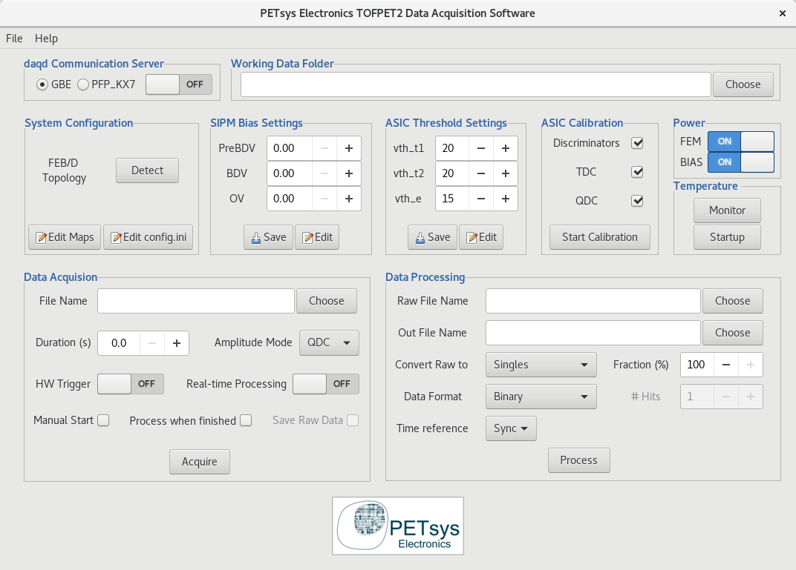

<div align="center">
<a href="https://www.petsyselectronics.com/web/"></a>
<a href="https://github.com/PETsys/sw_daq_tofpet2/releases"></a>
<a href="https://github.com/PETsys/sw_daq_tofpet2/blob/master/LICENSE"></a>
</div>

<br>

<div align="center">
<a href="https://www.petsyselectronics.com/web/"></a>
</div>

<h1 align="center">TOFPET2 Data Acquisition Software</h1>

<div align="center">

</div>

<div align="center">

</div>

# About

This repository contains the acquistion software designed by PETsys Electronics for the TOFPET2 Evaluation Kit and Readout Systems.

_For <b>official hardware and software guides</b> please check the <a href="https://www.petsyselectronics.com/web/public/pages/18">TOFPET2 Downloads/Documentation</a> section on our website._


# Requirements
### Operating System Compatibility
The OS must be 64-bit Linux. The distributions supported by PETsys Electronics are CentOS 7-2009, CentOS Stream 8, RHEL >=8.5 and Ubuntu versions 20.04 and 22.04.
### Dependencies
On supported distributions, all dependencies should be automatically installed during the installation procedure. If you are trying to run our software on a non-supported distribution, check the code of the `petsys-setup.sh` script for the list of dependencies.
### Compatibility
Different software releases may require different firmware versions in order to work correctly. Please refer to the _Readout System - Requirements and Compatibility_ document that can be found under the [TOFPET2 Downloads/Documentation](https://www.petsyselectronics.com/web/public/pages/18) section mentioned above.

# Installation

1. Download the latest [release](https://github.com/PETsys/sw_daq_tofpet2/releases) from our website or this repository and extract the files into a folder.
2. Install all requirements by running:
   ```sh
   su -
   sh petsys-setup.sh
   exit
   ```
3. Navigate to this new folder and create a 'build' folder:
   ```sh
   mkdir build
   cd build
   ```
4. Prepare the build compliation:
   * If using CENTOS7-2009:
   ```sh
   cmake3 -DCMAKE_BUILD_TYPE=Release ..
   ```
   * If using other supported distros:
   ```sh
   cmake -DCMAKE_BUILD_TYPE=Release ..
   ```
5. Finally, run:
   ```sh
   make
   ```

# Usage

PETsys provides a Graphical User Interface to control most of the functionalities of the DAQ Software. In order to start the GUI, just open a system terminal, navigate
to the software installation folder and type:

   ```sh
   ./start_gui
   ```

<div align="center">

</div>

More experienced users requiring custom functionality, can check out our utility scripts under `./petsys_util/` and/or make use of our Python libraries that can be found in `./petsys_py_lib/`.

_For detailed information and examples, please refer to [TOFPET2 Downloads/Documentation/Software User Guide](https://www.petsyselectronics.com/web/public/pages/18)._

# Contact

Please contact us via the following e-mail addresses or check contact information available on our [website](https://www.petsyselectronics.com/web/public/pages/10).

- Help and support:
	> support@petsyselectronics.com

- For general information and sales inquiries:
	> info@petsyselectronics.com

# Contributions

Thank you for considering contributing to this project. We welcome contributions to this project, whether it's:

- Reporting a bug (feel free to open a GitHub Issue)
- Submitting a fix
- Proposing new features


# License

Code, including source files and code samples if any in the content, is released under the **MIT License**, with the following exceptions:

* The driver components in `kernel` are under **GPL-2.0-or-later**; see `LICENSE` in the component's directory
